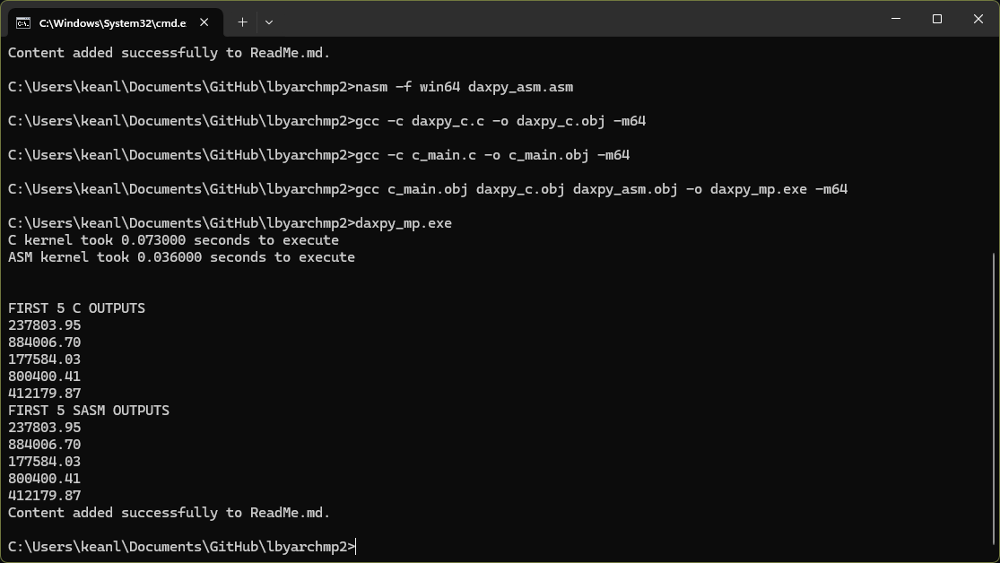

## Screenshots 

## Execution times of both programs

C file: 0.073000
ASM file: 0.036000

C file: 0.071000
ASM file: 0.033000

C file: 0.075000
ASM file: 0.034000

C file: 0.076000
ASM file: 0.036000

C file: 0.074000
ASM file: 0.034000

C file: 0.073000
ASM file: 0.035000

C file: 0.076000
ASM file: 0.035000

C file: 0.080000
ASM file: 0.035000

C file: 0.073000
ASM file: 0.035000

C file: 0.070000
ASM file: 0.034000

C file: 0.068000
ASM file: 0.034000

C file: 0.076000
ASM file: 0.035000

C file: 0.072000
ASM file: 0.033000

C file: 0.076000
ASM file: 0.034000

C file: 0.077000
ASM file: 0.035000

C file: 0.073000
ASM file: 0.035000

C file: 0.073000
ASM file: 0.035000

C file: 0.074000
ASM file: 0.036000

C file: 0.075000
ASM file: 0.034000

C file: 0.072000
ASM file: 0.036000

C file: 0.074000
ASM file: 0.033000

C file: 0.074000
ASM file: 0.035000

C file: 0.077000
ASM file: 0.032000

C file: 0.074000
ASM file: 0.037000

C file: 0.076000
ASM file: 0.035000

C file: 0.073000
ASM file: 0.035000

C file: 0.072000
ASM file: 0.033000

C file: 0.071000
ASM file: 0.036000

C file: 0.075000
ASM file: 0.034000

C file: 0.075000
ASM file: 0.034000

